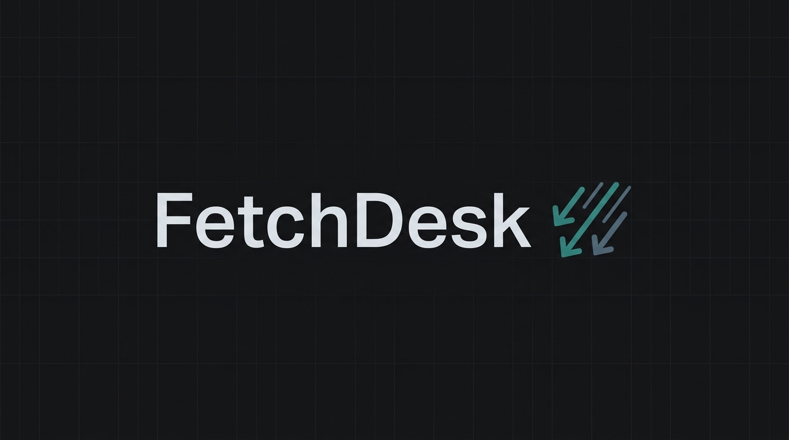

> [!NOTE]
> **[FetchDesk 0.2.0 is officially here](https://github.com/jojin1709/fetchdesk)**

<div align="center">



# FetchDesk - High-Performance Terminal-Based Multi-Connection Download Manager

FetchDesk is a powerful, lightning-fast CLI download manager designed for power users, ethical security researchers, software engineers, and media enthusiasts. <br />
It accelerates HTTP/HTTPS downloads using parallel multi-chunk streaming, handles YouTube videos with quality selection, and manages BitTorrent/Magnet transfers with automated peer discovery and drive space inspection.

**This repository contains FetchDesk Open Source: the full CLI engine, run locally from your command line.**

---

<a href="https://github.com/jojin1709/fetchdesk"></a>
<a href="https://github.com/jojin1709/fetchdesk/releases"></a>

---
</div>

> [!TIP]
> **Quick Start:** run the automated 1-line PowerShell installer to immediately set up FetchDesk and all dependencies (aria2c, yt-dlp, ffmpeg) on your system.

## Table of Contents

- [What is FetchDesk?](#what-is-fetchdesk)
- [Key Features](#key-features)
- [Quick Start](#quick-start)
- [Optional Helper Tools](#optional-helper-tools)
- [CLI Commands & Usage](#cli-commands-usage)
- [Repository Structure](#repository-structure)
- [License & Ethical Usage](#license-ethical-usage)

---

## What is FetchDesk?

FetchDesk is an open-source, high-performance download manager developed in Rust by [Jojin John](https://github.com/jojin1709). It brings the power of multi-threaded acceleration and specialized protocol engines directly to your terminal.

Whether you are fetching massive database dumps over HTTP, mirroring media channels from YouTube, or parsing BitTorrent trackers for high-speed seeder feeds, FetchDesk orchestrates the transfer pipelines autonomously with maximum throughput and minimum resource overhead.

### Why FetchDesk Exists

Standard browsers and CLI utilities (like `curl` or `wget`) download files in a single, linear TCP connection, which fails to saturate modern high-speed broadband connections. FetchDesk breaks through this bottleneck by segmenting files on-the-fly and downloading chunks in parallel. It also acts as a unified console, saving you from switching between separate clients for torrents, YouTube links, and direct file downloads.

---

## Key Features

- **🚀 16-Connection Parallel Acceleration**: Splits direct HTTP/HTTPS files into range-requested chunks and streams them concurrently into pre-allocated files for maximum bandwidth utilization.
- **🎥 YouTube Video & Playlist Downloader**: Native `yt-dlp` integration supporting 4K, 2K, 1080p, 720p, 480p, and Audio-only formats with native 16-way fragment acceleration.
- **🧲 BitTorrent & Magnet Link Engine**: Multi-seeder BitTorrent transfers with automatic tracker injection (`opentrackr`, `stealth.si`, `torrent.eu.org`), DHT, and Transmission peer-ID spoofing for priority unchokes.
- **💾 Smart Disk Space Inspector & Drive Switcher**: Automatically checks target drive free space (`GetDiskFreeSpaceExW`) before downloading. If the current drive (e.g. `C:\`) is low on space, FetchDesk displays an interactive drive selection menu to seamlessly switch to drives with available space (e.g. `D:\Downloads`).
- **📊 Sleek Animated Single-Line UI**: Replaces noisy terminal output with clean, animated `indicatif` progress bars displaying speed, ETA, percent, seeder counts, and peer metrics.
- **📜 Download History & CSV Export**: Tracks all downloads with timing, size, and status. Export history to escaped CSV format at any time.

---

## Quick Start

### ⚡ Instant 1-Line PowerShell Install (Windows)

No source code, `git clone`, or Rust setup required! Paste this single command into PowerShell to install and launch FetchDesk:

```powershell
iwr -useb https://raw.githubusercontent.com/jojin1709/fetchdesk/main/install.ps1 | iex
```

Or using `irm`:

```powershell
irm https://raw.githubusercontent.com/jojin1709/fetchdesk/main/install.ps1 | iex
```

> [!IMPORTANT]
> The PowerShell installer will guide you through installing optional CLI dependencies (`aria2c`, `yt-dlp`, `ffmpeg`) and give you the option to create a Desktop shortcut for FetchDesk.

---

### 🌐 Google Chrome & Microsoft Edge Extension

FetchDesk comes with an official browser extension that adds context-menu support (right-click download links or YouTube videos to instantly queue them) and a fast manual pasting popup interface.

**How to Install the Extension:**
1. Run the automated **PowerShell Installer** (which automatically downloads the extension to your local folder at `%LOCALAPPDATA%\FetchDesk\extension`), or download the `extension/` directory from this repository.
2. In Google Chrome or Microsoft Edge, go to `chrome://extensions/` (or `edge://extensions/`).
3. Enable **Developer mode** (toggle in the top-right corner).
4. Click **Load unpacked** (top-left corner) and select the `extension/` folder.
5. Launch the `fetchdesk` CLI app to start the background webhook server on port `8382`.

---

## Optional Helper Tools

To unlock YouTube quality extraction and BitTorrent features, install these optional tools (or let the `install.ps1` script handle them automatically):

| Component | Purpose | Windows Install | macOS Install | Linux Install |
| :--- | :--- | :--- | :--- | :--- |
| **`yt-dlp`** | YouTube Video Extraction | `pip install -U yt-dlp` | `brew install yt-dlp` | `sudo apt install yt-dlp` |
| **`aria2`** | BitTorrent / Magnet Engine | `winget install aria2.aria2` | `brew install aria2` | `sudo apt install aria2` |
| **`ffmpeg`** | Video & Audio Stream Merging | `winget install Gyan.FFmpeg` | `brew install ffmpeg` | `sudo apt install ffmpeg` |

---

## CLI Commands & Usage

At the `fetchdesk>` interactive prompt:

| Command | Action | Example |
| :--- | :--- | :--- |
| **`y`** | YouTube Video / Playlist | Paste YouTube URL (selects quality 1–13) |
| **`m`** | Magnet Link / `.torrent` Path | Paste `magnet:?xt=urn:...` or local `.torrent` path |
| **`d`** | Direct HTTP/HTTPS File | Paste direct file link (`https://example.com/file.zip`) |
| **`conns <n>`** | Set Parallel Connections | `conns 16` |
| **`out <path>`** | Set Output Directory | `out D:\Downloads` |
| **`history`** | Show Download Log | `history` |
| **`export`** | Export History to CSV | `export` |
| **`help` / `?`** | Display Command List | `help` |
| **`exit` / `q`** | Quit FetchDesk | `exit` |

---

## Repository Structure

```text
fetchdesk-src/
├── Cargo.toml          # Rust dependencies & package configuration
├── install.ps1         # One-liner PowerShell instant installer
├── assets/
│   └── github-banner-clean.jpg # Premium repository banner image
├── src/
│   ├── main.rs         # REPL prompt & CLI routing
│   ├── downloader.rs   # Direct multi-chunk HTTP downloader engine
│   ├── youtube.rs      # yt-dlp integration & quality selector
│   ├── torrent.rs      # aria2 BitTorrent & Magnet engine
│   ├── disk.rs         # Win32 disk space inspector & drive switcher
│   ├── config.rs       # System configuration & persistence
│   ├── history.rs      # Download history logger & CSV exporter
│   ├── queue.rs        # Concurrent download queue system
│   └── banner.rs       # ASCII banner & terminal UI utilities
└── docs/
    └── index.html      # Animated web dashboard & documentation
```

---

## License & Ethical Usage

Distributed under the **Proprietary License (All Rights Reserved)**. Created by **[JOJIN JOHN](https://github.com/jojin1709)**.

Please download responsibly. Ensure you have the rights to content retrieved using YouTube and BitTorrent protocols.
